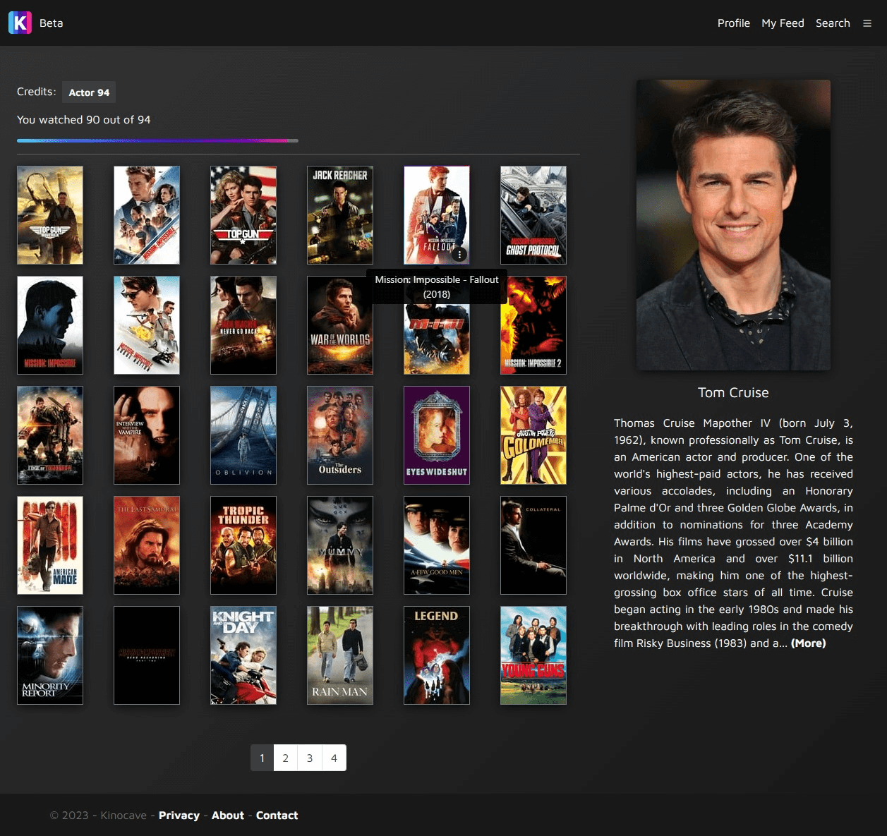
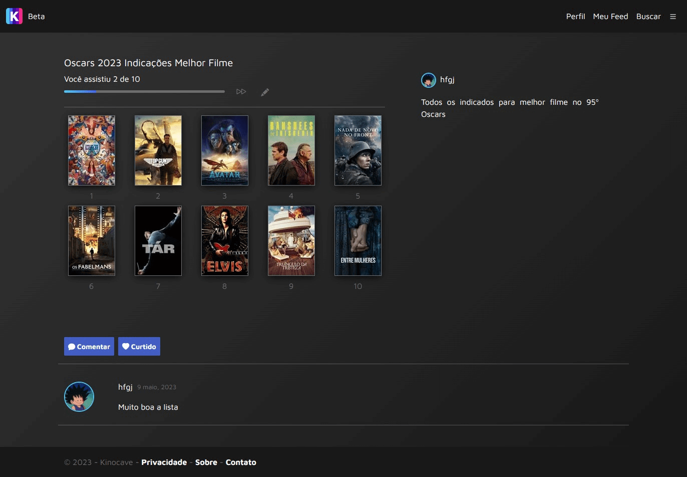

### Kinocave

#### [Visitar](https://kinocave.azurewebsites.net)

_Hospedage gratuita. Aguarde um momento para que o site saia do modo hibernação_

* * *

Kinocave é uma rede social para amantes de filmes, onde você pode registrar os filmes que você assistiu, criar avaliações, seguir outros usuários e muito mais.

Por enquanto está em fase de testes e desenvolvimento, mas já possui todas as funcionalidades básicas implementadas.

  

#### Algumas funcionalidades

*   Autenticação e autorização
*   Criação de avaliações de filmes, e diário de filmes assistidos
*   Visualização de filmes individuais, atores e diretores
*   Seguir outros usuários, e interagir com eles através de likes, comentários e seguindo-os

#### Screenshots

* * *

Kinocave possui versões em duas línguas, inglês e português, que mudam de acordo com as preferências do usuário.

Página principal em português

Página principal em inglês

Kinocave utiliza a API do The Open Movie Database para exibir as informações de filmes e pessoas.

Página de um filme em português

Página de um ator em inglês

Os usuários podem criar listas com temas específicos. Eles também podem criar avaliações dos filmes que assistem.

Página de uma lista em português

Página de uma avaliação em inglês

Usuários podem marcar filmes como assistidos, e estes são exibidos em seu perfil.

Página dos filmes de um usuário em português

Cada usuário tem o seu perfil, onde botem criar uma descrição e mostrar o que têm feito recentemente. Usuários podem seguir outros usuários, permitindo que eles vejam suas atividades em seu feed.

Perfil de um usuário em português

Feed em inglês

Também é possível realizar pesquisas de filmes e pessoas.

Página de busca de filmes em português

Página de busca de pessoas em inglês